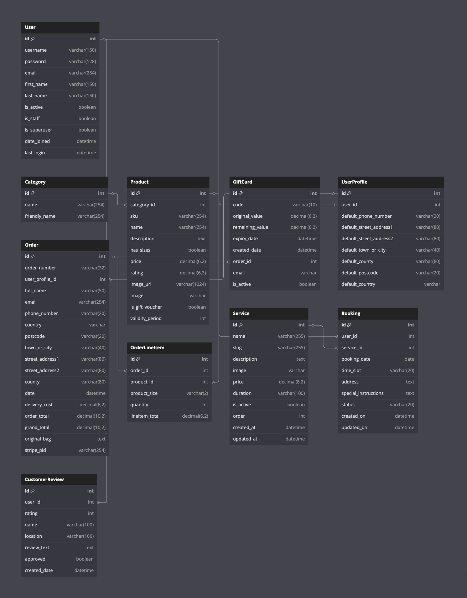

## Professional Mobile Car Valeting & Auto Detailing Services

Spec-A Detailing provides premium mobile car valeting services across Kildare and surrounding areas in Ireland. We bring professional detailing directly to your location, offering everything from basic exterior washes to premium ceramic coating, delivered by our skilled team of detailing specialists.

## Deployed Site

[View the live site on Heroku](https://spec-a-detailing-33916ed689f8.herokuapp.com/)


## Table of Contents

- Introduction
- UX
  - User Stories
  - Design Choices
  - Wireframes
- Features
  - Existing Features
  - Future Features
- Database Structure
- Technologies Used
- Testing
- Deployment
- Credits
- Business Plan

## Introduction

Spec-A Detailing is a comprehensive e-commerce platform for mobile car valeting services. Our website allows customers to browse services, make purchases, submit and read reviews, and manage their user profiles. With a focus on quality and convenience, we bring professional car care services directly to homes and workplaces across Kildare and beyond.

## UX

### User Stories

#### First-time Visitors
- As a first-time visitor, I want to easily understand what services are offered and their benefits
- As a first-time visitor, I want to navigate the website intuitively to find specific services
- As a first-time visitor, I want to read customer reviews to build trust in the service quality
- As a first-time visitor, I want to learn about the company's values and team members

#### Returning Customers
- As a returning customer, I want to quickly find and purchase services I need
- As a returning customer, I want to access my profile information and view past orders
- As a returning customer, I want to leave reviews about services I've received
- As a returning customer, I want my delivery information saved for faster checkout

#### Site Admin
- As a site admin, I want to add, edit, and remove service offerings
- As a site admin, I want to review and moderate customer reviews before publication
- As a site admin, I want to manage user orders and view purchase history
- As a site admin, I want to update pricing and promotional content easily

### Design Choices

The website features a professional and user-friendly design that emphasizes trust and quality:

- **Color Scheme**: Clean blue and white primary palette with contrasting dark elements for important features. The blue tones convey professionalism and reliability, essential qualities for a detailing business.

- **Typography**: Clear, modern fonts ensure readability across all devices while maintaining a professional appearance.

- **Imagery**: High-quality before/after images showcase the transformation of vehicles after our services. Professional photos of team members and detailing processes help build customer trust.

- **Layout**: Responsive design with intuitive navigation prioritizes service discovery and easy checkout. Clear call-to-action buttons guide users through the purchasing process.

## Features

### Existing Features

#### Navigation & Header
- Responsive navigation bar with collapsible menu on mobile devices
- Dropdown menus for service categories and user account options
- Persistent shopping bag with item count and total
- Search functionality for finding specific services

#### Homepage
- Hero section with compelling call-to-action buttons
- Service category highlights with direct links
- Featured customer reviews carousel
- Before/after image comparisons showing service quality
- Key benefits section emphasizing eco-friendly methods and time-saving convenience

#### About Page
- Company history and mission statement
- Team member profiles with specializations
- Core values and quality commitments
- Environmental approach to car cleaning

#### Services/Products
- Detailed service listings with clear descriptions and images
- Pricing structure with transparent display
- Service categorization (interior cleaning, exterior detailing, etc.)
- Add to bag functionality with quantity selection
- Admin controls for product management (add/edit/delete)

#### User Authentication
- Secure registration and login system via Django Allauth
- Email verification process
- Password reset functionality
- User profile dashboard

#### Reviews System
- Star rating mechanism (1-5 stars)
- Review submission form for registered users
- Admin approval workflow for new reviews
- Edit and delete functionality for user's own reviews
- Review display on homepage and dedicated reviews page

#### Shopping Bag
- Real-time update of bag contents
- Quantity adjustment options
- Running total calculation with delivery costs
- Remove item functionality
- Toast notifications for bag updates

#### Checkout
- Secure payment processing through Stripe
- Order summary display
- Delivery information form with save option
- Order confirmation page with details
- Confirmation email with order information

#### User Profile
- Saved delivery information management
- Order history with detailed view option
- Personal information update functionality

#### Gift Vouchers
- Gift card purchase options at different price points
- Code generation for gift card redemption
- Email delivery of gift voucher details

#### Admin Features
- Product/service management interface
- Order tracking and management
- Review moderation system
- User management capabilities

### Future Features

- **Online Booking Calendar**: Implement appointment scheduling with specific time slots
- **Loyalty Program**: Reward system for returning customers with points and discounts
- **Customer SMS Notifications**: Service updates and appointment reminders
- **Mobile Application**: Native app development for easier mobile ordering
- **Service Subscription Plans**: Regular maintenance packages with recurring billing
- **Advanced Before/After Gallery**: Expanded portfolio of completed detailing work
- **Live Chat Support**: Real-time customer assistance feature

## Database Structure

The project utilizes a PostgreSQL relational database with the following primary models:

### User / UserProfile
- Extended Django user model
- Stores delivery information
- Links to order history
- Authentication details

### Product
- Service details and descriptions
- Pricing information
- Category relationships
- Rating calculations
- Image storage

### Category
- Service classifications
- Friendly names for display
- Organizational structure

### Order
- Customer and delivery information
- Order date and number
- Payment status
- Links to line items

### OrderLineItem
- Individual services within orders
- Quantity information
- Product relationships
- Price calculations

### Review
- Customer feedback content
- Star ratings (1-5)
- Author relationships
- Approval status
- Creation timestamps

### GiftCard
- Code generation
- Value tracking
- Expiry management
- Redemption system

## Database Design

### Entity Relationship Diagram (ERD)

The database schema for Spec-A Detailing has been designed to support all core business functionality including user management, product catalog, ordering, gift card processing, and customer reviews. Below is the Entity Relationship Diagram showing how different models relate to each other:



### Database Relationships Explained

The diagram illustrates several key relationships:

1. **User and UserProfile**: One-to-one relationship. Each registered user has exactly one user profile that stores their default delivery information and order history.

2. **Product and Category**: Many-to-one relationship. Each product belongs to one category, while categories can have multiple products.

3. **Order and OrderLineItem**: One-to-many relationship. Each order can contain multiple line items, representing individual products purchased.

4. **UserProfile and Order**: One-to-many relationship. A user profile can be associated with multiple orders over time.

5. **Product and Review**: One-to-many relationship. Products can receive multiple reviews from different users.

6. **User and Review**: One-to-many relationship. Users can submit multiple reviews for different products.

7. **Order and GiftCard**: One-to-many relationship. An order can generate multiple gift cards when gift vouchers are purchased.

This database architecture ensures data integrity while providing the necessary flexibility to support all core business operations and future feature development.

## Technologies Used

### Languages
- **HTML5**: Structure and content
- **CSS3**: Styling and visual effects
- **JavaScript**: Interactive elements and form validation
- **Python**: Backend logic and data processing

### Frameworks
- **Django 3.2**: Full-stack Python web framework
- **Bootstrap 4**: Frontend component library for responsive design

### Libraries & Packages
- **Django Allauth**: User authentication and account management
- **Stripe**: Secure payment processing
- **AWS S3**: Cloud storage for static and media files
- **Crispy Forms**: Enhanced form rendering
- **jQuery**: JavaScript library for DOM manipulation
- **Font Awesome**: Icon library
- **Django Storages**: Custom storage backends for Django

### Databases
- **PostgreSQL**: Production database (via Neon)
- **SQLite**: Development database

### Tools & Programs
- **Git**: Version control system
- **GitHub**: Code repository
- **Heroku**: Cloud platform hosting
- **Visual Studio Code**: Code editor
- **AWS S3**: Cloud storage solution
- **Chrome DevTools**: Browser-based debugging and testing
- **W3C Validators**: HTML and CSS validation
- **JSHint**: JavaScript validation

## Testing

For comprehensive testing information, please see TESTING.md

### Manual Testing Summary
- User authentication flows
- Responsive design across multiple devices
- CRUD operations for products and reviews
- Checkout process with Stripe integration
- Form validations
- User profile functionality

### Validation Results
- HTML: Passed W3C validation
- CSS: Passed W3C validation
- JavaScript: Passed JSHint validation
- Python: PEP8 compliant
- Accessibility: WCAG 2.1 AA standards met

### Bug Fixes
- Resolved image loading issues with AWS S3 configuration
- Fixed Stripe payment processing for minimum charge amounts
- Corrected gift card code generation and redemption workflow
- Addressed responsive design issues on smaller screens

## Deployment

### Heroku Deployment

The site is deployed on Heroku using the following process:

1. Create a new Heroku app from the Heroku dashboard
2. Connect the app to your GitHub repository
3. Set up required environment variables in Heroku Config Vars:
   - `SECRET_KEY` - Django secret key
   - `DATABASE_URL` - PostgreSQL database URL
   - `AWS_ACCESS_KEY_ID` - AWS credential for S3 access
   - `AWS_SECRET_ACCESS_KEY` - AWS credential for S3 access
   - `AWS_S3_REGION_NAME` - AWS S3 bucket region
   - `STRIPE_PUBLIC_KEY` - Stripe API public key
   - `STRIPE_SECRET_KEY` - Stripe API secret key
   - `STRIPE_WH_SECRET` - Stripe webhook signing secret
   - `EMAIL_HOST_USER` - Email service username
   - `EMAIL_HOST_PASS` - Email service password
   - `USE_AWS` - Set to "True" for production
4. Add PostgreSQL as an add-on for database
5. Deploy the main branch
6. Ensure Procfile and requirements.txt are present in the repository

### Local Deployment

To run this project locally:

1. Clone the repository: `git clone https://github.com/rhos9/spec-a-detailing.git`
2. Install required packages: `pip install -r requirements.txt`
3. Create an env.py file in the root directory with required environment variables:
   ```python
   import os
   
   os.environ.setdefault('SECRET_KEY', 'your-secret-key')
   os.environ.setdefault('DEVELOPMENT', '1')
   os.environ.setdefault('STRIPE_PUBLIC_KEY', 'your-stripe-public-key')
   os.environ.setdefault('STRIPE_SECRET_KEY', 'your-stripe-secret-key')
   os.environ.setdefault('STRIPE_WH_SECRET', 'your-stripe-webhook-key')
   ```
4. Run migrations: `python manage.py migrate`
5. Create a superuser: `python manage.py createsuperuser`
6. Load fixture data:
   ```
   python manage.py loaddata categories
   python manage.py loaddata products
   ```
7. Run the server: `python manage.py runserver`

## Credits

### Code
- **Django Documentation**: Framework implementation guidance
- **Bootstrap Documentation**: Component design and responsive layout techniques
- **Code Institute**: Project structure and deployment workflow guidance
- **Stripe Documentation**: Payment processing implementation

### Content
- Professional service descriptions crafted for the Irish market
- Customer review system based on best e-commerce practices
- About section content highlighting team expertise

### Media
- Service images sourced from professional detailing resources
- Logo design by project owner
- Icons from Font Awesome library
- Placeholder images for team members and services

### Acknowledgements
- **Code Institute**: For education resources and project support
- **Mentor Support**: For guidance throughout the development process
- **Peer Reviews**: For testing and valuable feedback
- **Family and Friends**: For user testing and constructive feedback

## Business Plan

### Executive Summary

**Business Name:** Spec-A Detailing

**Business Model:** Mobile car valeting and auto detailing services with online booking and e-commerce platform

**Location:** Based in Kildare, Ireland with mobile service across surrounding counties

**Mission Statement:** To deliver premium car care services directly to customers' locations, providing convenience without compromising on quality.

**Vision:** To become the leading mobile car detailing service in Ireland, recognized for exceptional service quality, eco-friendly practices, and customer convenience.

### Business Objectives

- Establish a fully functional e-commerce and booking website within 3 months
- Acquire 200 regular customers within the first year
- Build partnerships with at least 5 corporate clients for fleet servicing
- Achieve break-even within 12 months of operation
- Generate positive customer reviews with an average rating of 4.7/5

### Products & Services

**Car Valeting Services:**
- Interior Cleaning & Detailing
- Exterior Wash & Wax
- Full Vehicle Detailing
- Engine Bay Cleaning
- Headlight Restoration
- Odor Removal

**Premium Services:**
- Ceramic Coating Application
- Paint Protection Film Installation
- Leather Conditioning & Protection
- Scratch & Swirl Mark Removal
- Vinyl Wrap Care

**Additional Offerings:**
- Gift Vouchers
- Corporate Fleet Packages
- Vehicle Maintenance Plans
- Mobile Service (We come to you)
- Vehicle Collection & Return Service (by arrangement)

### Market Analysis

**Target Audience:**
- Working professionals with limited time
- Luxury and sports car owners
- Corporate businesses with vehicle fleets
- Car enthusiasts and collectors
- New vehicle owners seeking protection packages

**Market Trends:**
- Growing demand for mobile services that save time
- Increasing interest in long-term vehicle protection (ceramic coatings, PPF)
- Rising awareness of eco-friendly cleaning products
- Higher expectations for professional service quality

**Competitive Advantage:**
- Premium mobile service that comes to the customer
- Highly trained specialists using professional-grade products
- Time-efficient booking and service process
- Transparent pricing with online payment options
- Eco-friendly products and water conservation techniques

### Marketing Strategy

**Channels:**
- SEO-optimized website with before/after galleries
- Social media content featuring transformational results
- Email marketing with seasonal promotions
- Local partnerships with car dealerships
- Google Ads targeting car-related searches

**Promotions:**
- New customer discount
- Referral program with rewards
- Seasonal detailing packages
- Loyalty program with progressive discounts
- Corporate fleet service trial offers

### Operations Plan

**Platform Development:**
- Django-based e-commerce website with secure payment processing
- Booking system with location, service, and time selection
- Customer account area for service history and preferences

**Service Delivery:**
- Fully equipped mobile detailing vans
- Professional equipment for waterless washing where appropriate
- Quality control checklists for each service
- Photo documentation of before/after results

### Sustainability Focus

**Environmental Commitment:**
- Eco-friendly, biodegradable cleaning products
- Water conservation techniques and recycling systems
- Waste reduction practices and proper disposal methods
- Carbon footprint reduction through efficient route planning